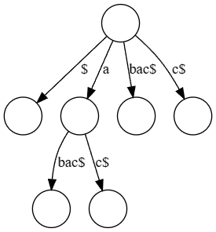
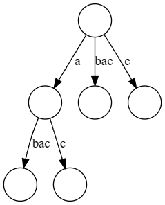

+++
title = 'Ukkonens Algortihm'
author = "Arlie"
description = "A wonderful journey about Ukkonen's Algorithm"
date = 2023-11-16T16:13:21+11:00
math = true
+++
### Prerequisite knowledge
- [Suffix Trees](https://external.ink?to=/en.wikipedia.org/wiki/Suffix_tree)

## Table of contents
- [A Brief Introduction](#a-brief-introduction)
- [Building the Algorithm From the Ground Up](#building-the-algorithm-from-the-ground-up)
  - [The core of Ukkonen's](#the-core-of-ukkonens)
    - [Implicit Suffix Trees](#implicit-suffix-trees)
    - [Phases and Extensions](#phases-and-extensions)
# A Brief Introduction
In your undergrad, you might have learned of **Suffix Trees**, an incredibly powerful data structure that can solve a plethora of problems relating to strings incredibly quickly. However as powerful as they may be, they were effectively useless as it would take $\mathcal{O}(n^2)$ time to build said tree via naively traversing each suffix of the string. Enter Ukkonen's Algorithm, a linear-time and _online_ algorithm for suffix tree construction that, unlike previous linear-time algorithms, is much easier to comprehend.

# Building the Algorithm From the Ground Up
Ukkonen's Algorithm is comprised of two components, the first being the core functionality of how we build our suffix tree, and the second is some tricks that are simply amazing and what give Ukkonen's its $\mathcal{O}(n)$ time complexity!

## The core of Ukkonen's
In this section, we will explore the first part of Ukkonen's which is the core functionality of the algorithm.

### Implicit Suffix Trees
The first thing Ukkonen's Algorithm utilizes is *implicit suffix trees*. We define implicit suffix trees as so:
>A suffix tree for a given string `S$` is the suffix tree of simply string `S`,i.e. we create a suffix tree without the null terminating character `$`.

For example here is the **suffix tree** of the string `abac` \

And here is the **implicit suffix tree** \

But why on earth are implicit suffix trees useful? Well, Ukkonens essentially builds implicit suffix trees each iteration, each one building off the other.

### Phases and Extensions
Phases and Extensions are how we handle updating the implicit suffix tree for each extension. In general, the goal of Ukkonen's Algorithm is to build the suffix tree for `S` by first constructing the corresponding **implicit** suffix tree. We do this by iterating of $n$ *phases*, where for each phase $i+1$ (where $1 \leqslant i + 1 \leqslant n$) the **implicit** suffix tree denoted $\mathcal{I}_{i+1}$ for the **prefix** `S[1...i+1]` is built. But how do we build it? Well, we do so in *extensions*. Extension $j$ of phase $i+1$ (where $1 \leqslant j \leqslant i+1$) will add the **substring** `S[j...i+1]` into the tree. We do this as follows
- Traverse the path for the substring `S[j...i]` within the current tree. This path is **guaranteed** to exist since $\mathcal{I}_i$ is already built.
- *Extend* this path by appending the character `S[i+1]` hence creating the path for the string `S[j...i+1]`